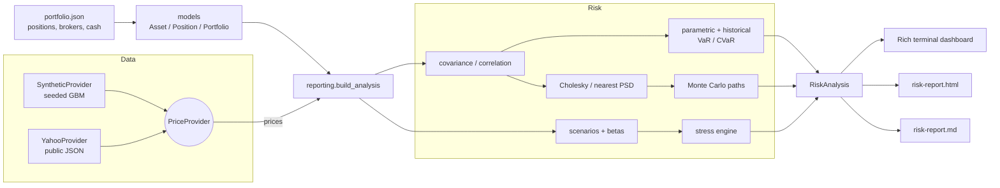

# Portfolio Risk Engine

**Multi-broker portfolio risk analytics and stress testing: one command from a JSON portfolio to an
audit-ready risk report.**

[](https://github.com/ozkaraonur/portfolio-risk-engine/actions/workflows/ci.yml)


Investors who split assets across brokers (equities at one, crypto at another, commodities at a
third) rarely see a single, consolidated risk picture. Portfolio Risk Engine aggregates positions
and cash across brokers and answers the questions a risk committee asks:

- How much can we lose over 10 days at 99% confidence? (**VaR / CVaR**)
- What does the loss distribution look like over a year, and how deep can drawdowns get? (**Monte Carlo**)
- What happens in 2008, March 2020 or 2022 again? (**Stress tests**)
- How much does diversification really save us? (**Diversification benefit**)

## Highlights

| Capability | Detail |
| --- | --- |
| Multi-broker portfolios | Same asset at several brokers is aggregated; per-broker cash; equities, crypto, commodities |
| Risk metrics | Parametric and historical-simulation VaR / CVaR at 95% / 99%, 1-day / 10-day horizons; fat-tail models (EWMA, Student-t, Cornish-Fisher, filtered historical simulation) via `--all-methods` |
| Risk attribution | Component / marginal VaR and CVaR per position (Euler allocation; hedges show up as negative contributions) |
| Optimisation | Long-only min-variance, risk-parity and max-Sharpe weights over the risky assets, efficient frontier, self-financing trades to reach them |
| Model validation | Rolling VaR backtest with Kupiec / Christoffersen tests, Basel traffic-light zones and violation charts in the reports |
| Monte Carlo | Cholesky-correlated multivariate GBM (normal or Student-t shocks, sample / EWMA / Ledoit-Wolf covariance), terminal percentiles, drawdown distribution, first-passage ruin probability |
| Stress testing | Built-in historical shocks, custom class / tag / symbol shocks, beta-driven market shocks |
| Web panel | Streamlit UI: portfolio builder, one-click analysis, HTML report download |
| Reporting | Rich terminal dashboard, zero-dependency HTML report (inline CSS/SVG), Markdown summary |
| Data | Offline seeded GBM provider (tests, demos), Yahoo Finance public-data provider (no API key, incl. BIST) with an on-disk cache, FX conversion, broker CSV import |
| Engineering | Pydantic v2 models, `mypy --strict`, ruff, 230+ deterministic tests, Docker, CI on 3.11 / 3.12 |

## Architecture



```
src/portfolio_risk/
  models/      Asset, Position, CashBalance, Portfolio (immutable pydantic v2 models)
  data/        PriceProvider ABC, SyntheticProvider (GBM), YahooProvider, CachedProvider, FX (fx.py)
  importers.py broker CSV -> Portfolio
  risk/        covariance, var, tail_models, estimators, attribution, optimize, backtest,
               coverage, linalg,
               monte_carlo, scenarios, stress, report
  reporting/   analysis (orchestration), terminal, html, markdown
  web/         Streamlit panel (app.py) and UI-independent table -> Portfolio builder
  cli.py       Typer CLI: summary | risk | attribute | optimize | backtest | simulate |
               stress | report | web
```

## Quick start

```bash
git clone https://github.com/ozkaraonur/portfolio-risk-engine && cd portfolio-risk-engine
python -m venv .venv && source .venv/bin/activate      # Windows: .venv\Scripts\activate
pip install -r requirements.txt && pip install -e .

pre report examples/portfolio.json --html output/risk-report.html --markdown output/risk-report.md
```

No internet is needed: the default provider generates reproducible synthetic prices. Use
`--provider yahoo` for real market data (BIST, US equities, crypto, futures, FX).

### Real data, cache and currencies

- **Cache.** Yahoo downloads are cached per symbol under `~/.cache/portfolio-risk-engine` and reused
  while they cover the requested range and are younger than 12 hours. Global options go before the
  command: `pre --no-cache ...`, `pre --cache-dir DIR ...`, `pre --cache-ttl-hours 1 ...`.
- **Currencies.** `Asset.currency` and `CashBalance.currency` may differ from `base_currency`
  (`--provider yahoo` reads pairs such as `EURUSD=X`, inverting when needed; the synthetic
  provider has an offline rate table). A foreign-currency asset's price series is multiplied by the
  daily rate, so its returns, VaR and stress results include the FX move. Foreign cash is converted
  at the latest rate and treated as fixed base-currency cash (no FX risk of its own).
- **Broker exports.** `pre import ibkr=positions.csv binance=coins.csv -o portfolio.json` reads
  position CSVs, matching columns by name (symbol/ticker/coin, quantity/position/total/shares,
  currency, asset class), sniffing `,` `;` tab delimiters and accepting `1,234.50` or `1.234,50`.
  Fiat rows and stablecoins (USDT, USDC, ...) become cash; known symbols are enriched from the
  catalog (name, tags, data symbol). Multi-section broker statements (e.g. a full IBKR activity
  report) must be reduced to the positions table first.

### Portfolio format

```json
{
  "name": "demo",
  "base_currency": "USD",
  "positions": [
    {"asset": {"symbol": "AAPL", "asset_class": "equity", "tags": ["tech"]}, "quantity": 50, "broker": "ibkr"},
    {"asset": {"symbol": "AAPL", "asset_class": "equity", "tags": ["tech"]}, "quantity": 20, "broker": "schwab"},
    {"asset": {"symbol": "BTC", "asset_class": "crypto"}, "quantity": 0.2, "broker": "binance"}
  ],
  "cash": [{"broker": "ibkr", "amount": 5000}]
}
```

### Commands

| Command | Purpose |
| --- | --- |
| `pre import BROKER=FILE.csv ... -o portfolio.json` | Merge broker position exports into a portfolio file |
| `pre summary <file>` | Latest valuation and weights |
| `pre risk <file> --confidence 0.99 --horizon 10 [--all-methods]` | Parametric and historical VaR / CVaR, diversification, correlations; all six models with `--all-methods` |
| `pre attribute <file> [--method historical]` | Component VaR / CVaR, share and marginal VaR per position |
| `pre optimize <file> [--objective risk-parity] [--max-weight 0.5] [--frontier 10]` | Optimal long-only weights, VaR change and the trades to get there |
| `pre backtest <file> --confidence 0.99 --window 250` | Rolling one-day VaR backtest: violations, Kupiec / Christoffersen tests, Basel zone for all six models |
| `pre simulate <file> -n 10000 -t 252 --seed 42 [--df 5] [--cov-method ewma]` | Monte Carlo VaR / CVaR, percentiles, drawdowns, ruin probability |
| `pre stress <file> [--scenario gfc-2008] [--custom "equity=-0.15,crypto=-0.30"] [--market-shock -0.10]` | Scenario P&L per asset, worst case |
| `pre report <file> --html report.html --markdown report.md` | Everything at once: dashboard plus reports |
| `pre check <file> <limits.json> [--record]` | Compare the portfolio with risk limits; prints each limit and **exits with code 2 on any breach** (usable in cron / CI) |
| `pre history [--portfolio NAME]` | Recorded runs over time: value, headline VaR, change since the previous run, top risk contributor, breaches |
| `pre web` | Launch the Streamlit web panel |

```bash
pre stress examples/portfolio.json --custom "equity=-0.15,tag:tech=-0.30,BTC=-0.5"
pre stress examples/portfolio.json --market-shock -0.10 --benchmark SPY --provider yahoo
python examples/run_demo.py          # offline end-to-end demo -> ./output
```

### Risk limits and history

`examples/limits.json` shows every supported limit; only the ones present are checked:

```json
{"max_var_pct": 0.12, "max_asset_weight": 0.5, "max_risk_share": 0.6,
 "min_cash_ratio": 0.05, "max_ruin_probability": 0.05}
```

`max_var_pct` is the headline parametric 10-day 99% VaR as a fraction of portfolio value;
`max_risk_share` caps one asset's share of that VaR (see risk attribution). `--record` on
`pre check` or `pre report` appends the headline figures to a SQLite file
(`~/.cache/portfolio-risk-engine/history.sqlite`, override with `--db`), and `pre history` shows how
they moved between runs. Monte Carlo runs are simulated in batches of 10,000 paths, so memory stays
bounded for very large `-n`; results are identical to a single batch for normal shocks.

### Web panel (Streamlit)

Build a portfolio in the browser (no JSON editing), run the analysis with one click and download the
HTML report:

```bash
pre web                       # opens http://localhost:8501
pre web --port 9000 --no-browser
docker run --rm -p 8501:8501 portfolio-risk web --host 0.0.0.0 --no-browser
```

Add positions by picking a **category** (ABD Hisseleri, BIST, Kripto, Emtia), then an **asset by name**
(e.g. `THYAO - Türk Hava Yolları`, `SOL - Solana`) and entering only the quantity. Symbol, asset class,
tags (`tech`, `aviation`, `crypto`, ...) and broker are linked automatically from the built-in
[asset catalog](src/portfolio_risk/catalog.py) (35+ US stocks and ETFs, 35+ BIST stocks, 13 crypto assets,
7 commodities). The sidebar holds the cash balances, the analysis parameters (confidence 95% / 99%,
horizon 1 / 10 days, 1,000 / 5,000 simulations) and **Load Sample Portfolio**. The results view shows
the executive summary cards, VaR / CVaR, the correlation heat map, Monte Carlo percentiles and the
stress summary, with **HTML Raporu İndir** (`risk-report.html`), a Markdown download and a live
preview of the full report. Prices in the panel always come from the offline synthetic engine,
calibrated per catalog asset (volatility, drift, start price and a market/group factor structure that
yields realistic cross-asset correlations, e.g. BTC-ETH ≈ 0.75, gold-silver ≈ 0.75, S&P stocks ≈ 0.55).
The panel binds to `localhost` by default.

### Docker

```bash
docker build -t portfolio-risk .
docker run --rm portfolio-risk report examples/portfolio.json
docker run --rm -v "$(pwd)/output:/app/output" portfolio-risk report examples/portfolio.json \
    --html output/risk-report.html --markdown output/risk-report.md
docker compose up          # same, using docker-compose.yml
```

## Report preview

Terminal dashboard (`python examples/run_demo.py`: synthetic data, fixed window, seed 42):

```text
+--------------------------- Risk Dashboard: demo ----------------------------+
| Value  39,500.00 USD   Cash  15.2%   Top risk  BTC   10d 99% VaR  4,422.31  |
+------------------- as of 2025-12-31 | 782 obs | seed 42 --------------------+
Allocation
+----------------------------------------------------------+
| Symbol |     Class |     Value | Weight | Standalone VaR |
|--------+-----------+-----------+--------+----------------|
| AAPL   |    equity | 13,300.00 |  33.7% |       1,832.70 |
| BTC    |    crypto | 13,000.00 |  32.9% |       3,605.48 |
| GOLD   | commodity |  7,200.00 |  18.2% |         509.86 |
| CASH   |      cash |  6,000.00 |  15.2% |              - |
+----------------------------------------------------------+
Correlation
+---------------------------+
|      | AAPL |  BTC | GOLD |
|------+------+------+------|
| AAPL | 1.00 | 0.22 | 0.03 |
| BTC  | 0.22 | 1.00 | 0.01 |
| GOLD | 0.03 | 0.01 | 1.00 |
+---------------------------+
VaR / CVaR
+-------------------------------------------------------------------+
| Method     | Horizon | Conf. |      VaR |     CVaR | Div. benefit |
|------------+---------+-------+----------+----------+--------------|
| parametric |      1d |   95% |   988.78 | 1,239.97 |        25.7% |
| parametric |      1d |   99% | 1,398.46 | 1,602.16 |        25.7% |
| parametric |     10d |   95% | 3,126.81 | 3,921.14 |        25.7% |
| parametric |     10d |   99% | 4,422.31 | 5,066.48 |        25.7% |
| historical |      1d |   95% |   906.02 | 1,104.93 |        27.9% |
| historical |      1d |   99% | 1,234.25 | 1,428.58 |        26.2% |
| historical |     10d |   95% | 3,078.00 | 3,735.41 |        18.8% |
| historical |     10d |   99% | 4,140.39 | 4,383.86 |        23.7% |
+-------------------------------------------------------------------+
Risk attribution
+-----------------------------------------------------------+
| Symbol |  Exposure | VaR contrib. | Share | CVaR contrib. |
|--------+-----------+--------------+-------+---------------|
| AAPL   | 13,300.00 |     1,088.35 | 24.6% |      1,246.89 |
| BTC    | 13,000.00 |     3,266.29 | 73.9% |      3,742.07 |
| GOLD   |  7,200.00 |        67.66 |  1.5% |         77.52 |
+-----------------------------------------------------------+
Optimisation
+-----------------------------------------------------------------------------+
| Allocation   |  AAPL |   BTC |  GOLD | Return |  Vol. |      VaR | VaR chg. |
|--------------+-------+-------+-------+--------+-------+----------+----------|
| current      | 39.7% | 38.8% | 21.5% |  17.6% | 28.5% | 4,422.31 |          |
| min-variance | 18.6% |  3.0% | 78.4% |   7.3% | 13.6% | 2,113.98 |   -52.2% |
| risk-parity  | 27.5% | 13.8% | 58.8% |  10.8% | 15.8% | 2,451.82 |   -44.6% |
| max-sharpe   | 45.5% | 12.5% | 42.0% |  13.0% | 18.1% | 2,816.84 |   -36.3% |
+-----------------------------------------------------------------------------+
VaR backtest (99% one-day, 532 days)
+----------------------------------------------------------------------+
| Method         | Violations | Expected | Kupiec p | Indep. p |  Zone |
|----------------+------------+----------+----------+----------+-------|
| parametric     |          3 |      5.3 |    0.271 |    0.854 | green |
| historical     |          6 |      5.3 |    0.772 |    0.711 | green |
| ewma           |          3 |      5.3 |    0.271 |    0.854 | green |
| student-t      |          3 |      5.3 |    0.271 |    0.854 | green |
| cornish-fisher |          3 |      5.3 |    0.271 |    0.854 | green |
| fhs            |          5 |      5.3 |    0.888 |    0.758 | green |
+----------------------------------------------------------------------+
Monte Carlo (10,000 x 252d)
+------------------------------------+
| Metric        |     Value | Change |
|---------------+-----------+--------|
| 5th pct       | 27,266.99 | -31.0% |
| Median        | 37,660.70 |  -4.7% |
| 95th pct      | 58,543.22 | +48.2% |
| VaR 95%       | 12,233.01 | -31.0% |
| CVaR 95%      | 14,052.29 | -35.6% |
| VaR 99%       | 15,260.79 | -38.6% |
| CVaR 99%      | 16,530.04 | -41.8% |
| P(MDD >= 10%) |     99.8% |        |
| P(MDD >= 20%) |     70.8% |        |
| P(MDD >= 30%) |     25.6% |        |
| P(ruin, -30%) |    10.55% |        |
+------------------------------------+
Stress tests
+-------------------------------------------------------+
| Scenario       |        P&L | Loss % | Stressed value |
|----------------+------------+--------+----------------|
| gfc-2008       | -12,705.00 | -32.2% |      26,795.00 |
| covid-2020     | -12,290.00 | -31.1% |      27,210.00 |
| inflation-2022 | -11,305.00 | -28.6% |      28,195.00 |
+-------------------------------------------------------+
+-------------------------------- Worst case ---------------------------------+
| gfc-2008 loses 12,705.00 USD (32.2%); remaining capital 26,795.00 USD       |
+-----------------------------------------------------------------------------+
```

The full artefacts of this run are committed in [`docs/sample/`](docs/sample):
[`risk-report.html`](docs/sample/risk-report.html) (self-contained, light/dark aware, prints cleanly)
and [`risk-report.md`](docs/sample/risk-report.md). The HTML report contains: Executive Risk Summary
(portfolio value, cash ratio, highest-risk asset, 10-day 99% VaR), allocation and a correlation heat
map, statistical risk table, Monte Carlo distribution chart with drawdown probabilities, and a crisis
resilience table with per-asset drill-downs.

## Methodology

Notation: `w` is the vector of asset exposures in currency, `Σ` the covariance matrix of daily
returns, `c` the confidence level, `h` the horizon in trading days, `z_c = Φ⁻¹(c)`.

### Parametric (variance-covariance) VaR and CVaR

Zero-mean normal returns and square-root-of-time scaling:

```
σ_p  = sqrt(wᵀ Σ w) · sqrt(h)
VaR  = z_c · σ_p
CVaR = σ_p · φ(z_c) / (1 − c)          (Expected Shortfall)
```

### Historical simulation

Each historical day (compounded over `h` days, overlapping windows) is applied to today's exposures
to build a P&L distribution. VaR is its `(1 − c)` quantile loss; CVaR is the mean loss beyond it. No
distributional assumption, but limited to what the sample has seen.

### Fat-tail and volatility-aware models

`pre risk --all-methods` and `pre backtest` add four estimators next to the two classic ones. Except
where noted they work on the portfolio P&L of today's exposures over the estimation window and use
square-root-of-time scaling for `h > 1`.

| Model | Idea |
| --- | --- |
| `ewma` | Normal VaR with a RiskMetrics exponentially weighted covariance (`λ = 0.94`): reacts quickly to volatility regimes |
| `student-t` | Same volatility as the normal model, Student-t tail shape; `df` from the sample excess kurtosis (`df = 4 + 6 / k`, clamped to `[4.1, 100]`) |
| `cornish-fisher` | Normal quantile corrected for sample skewness and kurtosis; never below the normal quantile because the expansion stops being monotone for extreme moments |
| `fhs` | Filtered historical simulation: historical P&L divided by the EWMA volatility of the day before, rescaled with tomorrow's forecast |

Monte Carlo can use multivariate Student-t shocks (`--df`, one chi-square mixing draw per path-day
shared by all assets, so extremes hit together) and three covariance estimators (`--cov-method
sample | ewma | shrinkage`, the last being Ledoit-Wolf shrinkage towards a scaled identity).

### Diversification benefit

```
benefit = Σᵢ VaRᵢ(standalone) − VaR(portfolio)         ratio = benefit / Σᵢ VaRᵢ
```

Perfectly correlated assets give 0; uncorrelated equal-risk pairs give `1 − 1/√2 ≈ 29.3%`.

### Monte Carlo: correlated GBM with Itô correction

Asset prices follow geometric Brownian motion. Over one day (`dt = 1` in daily units):

```
ln(Sₜ₊₁ / Sₜ) = (μ − ½ diag(Σ)) + L z,      z ~ N(0, I),   L Lᵀ = Σ
```

`L` is the Cholesky factor of `Σ`, which makes the shocks correlate as observed. The `−½σ²` Itô term
keeps the *arithmetic* mean return equal to `μ` (default 0, i.e. risk-only; `--drift` uses historical
means). Non-positive-definite or singular estimates are repaired by eigenvalue clipping while
preserving variances (`nearest_psd`). Positions are buy-and-hold and cash earns nothing. Outputs:
horizon VaR/CVaR, terminal percentiles, the distribution of maximum drawdown, and the **first-passage
ruin probability** (chance a path *touches* the loss threshold at any time, always ≥ the probability of
ending below it).

### Risk attribution

For the parametric model the portfolio VaR is `z · sqrt(wᵀΣw)`, which is homogeneous of degree one
in the exposures `w`. Euler's theorem then splits it exactly:

```
component VaRᵢ  = z · wᵢ (Σw)ᵢ / sqrt(wᵀΣw)            Σᵢ component VaRᵢ = VaR
marginal VaRᵢ   = component VaRᵢ / wᵢ                    (VaR added per currency unit of exposure)
```

CVaR is split the same way. A position that is negatively correlated with the rest has a negative
component: it hedges. The historical version splits CVaR by averaging each position's P&L over
the loss-tail scenarios; VaR, which is a single scenario and too noisy to split, is allocated in
proportion to those CVaR components.

### Portfolio optimisation

`pre optimize` works on the risky assets only (cash is left alone), long-only and fully invested,
on annualised inputs (`252 · Σ`, `252 · mean`).

| Objective | Problem |
| --- | --- |
| `min-variance` | minimise `wᵀΣw` (SLSQP), optional per-asset cap `--max-weight` |
| `risk-parity` | equal risk contributions, from the convex problem `min 0.5 wᵀΣw - (1/n) Σ ln wᵢ` (rescaled to sum to one); caps do not apply |
| `max-sharpe` | maximise `(μᵀw - r_f) / sqrt(wᵀΣw)` from several starts; undefined if no asset has a positive excess return |

`--frontier N` prints minimum-volatility portfolios between the global minimum-variance point and
the best reachable return. Trades are `target weight × invested amount − current value`, so they
sum to zero. The reports compare the current allocation with each objective by 10-day 99%
parametric VaR.

Expected returns are annualised sample means. Over a couple of years they are dominated by noise
(on the synthetic sample max-Sharpe simply concentrates in the best-performing asset), so the
return-based objectives and the frontier are indicative; min-variance and risk-parity use only the
covariance and are far more stable.

### VaR backtesting

`pre backtest` checks whether the VaR models are honest. For every test day the one-day VaR is
estimated from the trailing `window` returns only and compared with the realised P&L of today's
exposures (a hypothetical backtest, so trading is excluded). A *violation* is a day whose loss
exceeds the forecast.

- **Kupiec POF**: is the violation rate equal to `1 - confidence`? (likelihood ratio, chi-square 1 d.o.f.)
- **Christoffersen independence**: do violations cluster? A first-order Markov chain is compared
  with a constant rate. The joint **conditional coverage** test adds both statistics (2 d.o.f.).
- **Basel traffic light**: green / yellow / red from the binomial tail of the violation count
  (0-4 / 5-9 / 10+ violations for 250 days at 99%).

Synthetic prices are Gaussian, so the models usually pass on them; the tests are meant to expose
fat tails and volatility clustering in real data. The reports include the table for all six models
plus a P&L-versus-VaR chart with the violations marked.

Model comparison on simulated data (one-day 99% VaR, 250-day window; `p` below 0.05 rejects). These
runs use the seeded generators of `tests/test_backtest.py`, whose assertions check the ordering of
the models rather than these exact counts (the Student-t test uses a shorter sample):

| Data | Model | Violations (expected) | Kupiec p | Independence p |
| --- | --- | --- | --- | --- |
| GARCH(1,1), 3,750 test days | parametric | 54 (37.5) | 0.011 | 0.008 |
| | historical | 61 (37.5) | 0.000 | 0.003 |
| | **ewma** | 42 (37.5) | 0.469 | 0.329 |
| | student-t | 48 (37.5) | 0.099 | 0.026 |
| | fhs | 52 (37.5) | 0.025 | 0.753 |
| i.i.d. Student-t(3), 5,750 test days | parametric | 111 (57.5) | 0.000 | 0.247 |
| | historical | 77 (57.5) | 0.014 | 0.391 |
| | ewma | 140 (57.5) | 0.000 | 0.408 |
| | student-t | 83 (57.5) | 0.002 | 0.159 |
| | cornish-fisher | 40 (57.5) | 0.014 | 0.285 |

Volatility clustering (GARCH) is handled by EWMA and FHS; static fat tails (i.i.d. t) are not:
EWMA overreacts to single outliers there and is the worst model, while Cornish-Fisher is
over-conservative (40 violations against 57.5 expected) because moments from 250 samples are noisy.

### Stress testing

Instantaneous shocks `sᵢ` applied to current values: `P&Lᵢ = Vᵢ · sᵢ`; cash is unshocked.
Precedence per asset: symbol > tag > asset class.

| Scenario | Equity | Crypto / high risk | Commodity |
| --- | ---: | ---: | ---: |
| `gfc-2008` | −45% | −60% | +15% |
| `covid-2020` | −30% | −50% | −25% |
| `inflation-2022` | −20% (tech/growth −35%) | −65% | +25% |

Beta shocks: `βᵢ = Cov(rᵢ, r_m) / Var(r_m)` against a benchmark (default SPY); a market move `m`
hits asset `i` by `βᵢ · m` (floored at −100%), and the portfolio beta is the value-weighted average
with cash at zero.

## Assumptions and limitations

- Reports are model outputs, not forecasts or investment advice; the optimiser ignores costs, taxes and liquidity.
- Long-only positions. Foreign-currency cash is converted at the latest rate (no FX risk), and the web panel and catalog are USD-based.
- Parametric VaR assumes zero-mean normal returns (no fat tails or skew); the backtest can flag this and the fat-tail models are alternatives, not fixes: Student-t and Cornish-Fisher use moments estimated from one window; historical VaR needs a representative sample.
- Synthetic data is for testing and demos. Its volatilities and correlations are configurable
  defaults, not market estimates.
- Yahoo Finance is an unofficial public endpoint: it can change or rate-limit without notice, and the test suite exercises it only with injected fake responses. Prices are dividend-adjusted closes. Stooq now sits behind a JavaScript check and no longer works from scripts (`--provider stooq` explains this).
- BIST assets are quoted in TRY and converted with Yahoo (or synthetic) FX; the catalog lists their synthetic prices in lira. Other catalog assets are USD.

## Development

```bash
pytest                    # offline, deterministic
ruff check . && ruff format --check .
mypy                      # strict, configured in pyproject.toml
```

Conventions are documented in [`CLAUDE.md`](CLAUDE.md). CI runs all checks on Python 3.11 and 3.12
and builds the Docker image.

## License

MIT, see [`LICENSE`](LICENSE).
